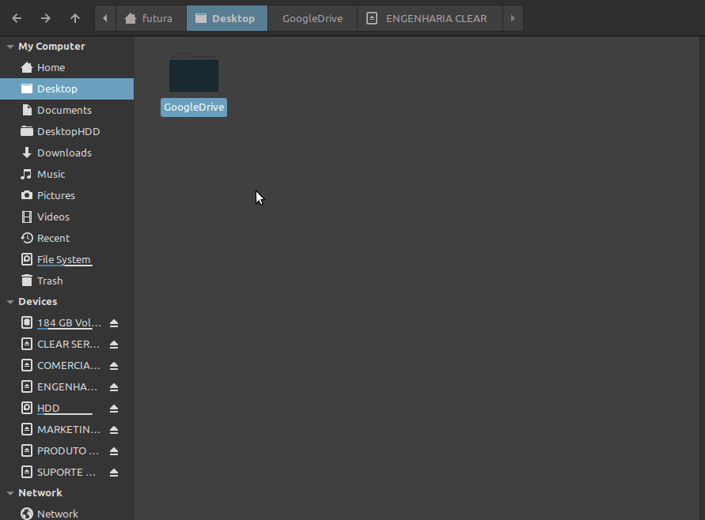

# Montar Shared Drives em linux usando google-drive-ocamlfuse

Utilizando codigo de https://github.com/astrada/google-drive-ocamlfuse

# Uso 
1. Dentro da pasta `drives_ids` definir um arquivo .txt que atenda aos installs desejados, o arquivo nao deve conter as linhas vazias
2. Instalar ocamlfuse e os drives compartilhados correspondentes executando `python3 installation.py < arquivo de labels e ids >`, isso deve fazer todas as etapas de instalacao.
	Exemplo : `python3 installation.py ./drives_ids/engenharia_clear.txt`
3. Se está instalando pela primeira vez, aceite as instalacoes do app
4. Permita acesso no navegador de acordo com a conta que já tem acesso ao drive de equipe.
5. Para que o processo seja totamente finalizado não interrompa o processo, espere executar ate o final

## Advanced mode
1. `python3 install_on_this_session.py` - vai instalar somente esta sessao, deve-se verificar que o mountpoint criado esta ok e de acordo com o MOUNT_PATH
	- O porcesso ira pedir o usuaário logado, utilize o usuário do indivíduo
2.  `python3 install_automount.py` - isso permite que depois de reiniciar as pastas sejam montadas sem problemas

## Justificativa:
- Insync é pesado, devido a sua up to date syncronization. Sempre que alguma alteração é feita, tudo é atualizado, e sincronizado
- Isso aumenta muito o consumo de CPU, o que deixa tudo mais lento. Característica muito prejudicial para computadores mais fracos, como o da empresa, 
- Mesmo sincronizando apenas páginas necessárias dentro do Insync acredito que o consumo ainda é mais alto do que o desejado

## Objetivo
- Montar Drives compartilhados requer passos repetitivos e dificeis de entender para o usuario , por isso resolvi automatizar

## Melhoramentos
- Gostaria de aumentar as configuracoes de cache, ja que melhoraria um pouco a experiencia.
- Refatoração é essencial para aprimorar suas habilidades, revistiar e fazer sentido das coisas, inclusives é somente reconhecendo os erros e aprendendo com eles é que se evolui

## Opcoes de projeto
- script que capture as ids corretas desejadas - pre processado
	- tendo estas ids, pode-se optar por remover algumas. -preprocessed
- script que conduza todas as etapas para qqr drive compartilhado
- run main.

# Logs
- Primeiro contato e testando depois de receber do a sugestão de Matheus
- Seguindo tutorial de mount e autumount, testando xpath para adm_vtv e drive@clear
- 23/08/2021 - refatorando com diretorios e modularizacao, preciso testar as separacoes.
- 05/10/2021 - refatorando tudo e retestando ate o mount, automount precisa de testes
- 06/10/2021 - funcoes core testadas ok, lancamento do alfa para testes.
- 11/10/2021 - Correcao de avisos no terminal mounts do .proflie executando em subshell, Upload de repo no Github